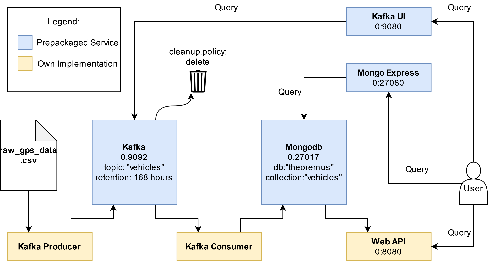

# Theoremus Backend Task

## Quickstart

How to run the task with docker-compose:

1. Insert data for the producer at ./kafka-producer/data/raw_gps_data.csv
2. Modify ./kafka-producer/conf.json to match your Kafka configuration (The default values should work if running Kafka from docker-compose)
3. _docker-compose up_. After the services are up and running, you should see lots of messages coming from kafka-producer and kafka-consumer. Unless they are errors, this is intentional. At this point, you could head to _localhost:27080_ (Mongo Express) or _localhost:9080_ (Kafka-UI) to monitor the data flow from the pipeline. Finally, you can test the web API like this: _localhost:8080/vehicles/from <rfc3339 time>/to <rfc3339 time>/(day|hour)_. For example:

[http://localhost:8080/vehicles/2020-09-24T01:40:02Z/2022-09-24T01:40:02Z/day](http://localhost:8080/vehicles/2020-09-24T01:40:02Z/2022-09-24T01:40:02Z/day)

## Architecture overview

_Kafka Producer_ is the first member of the data pipeline. It reads messages from a .CSV file, filters out the messages without valid GPS data and sends the rest to Kafka.

_Kafka_ Is the intermediary between _Kafka Producer_ and _Kafka Consumer_, allowing them to pass messages to each other asynchronously.

_Kafka Consumer_ Fetches the data from Kafka and prepares it for insertion into MongoDB. Additionally, the fields "IDDay" and "IDHour" are computed and added to the message to facilitate queries which aggregate on this information. For example, if the data.date-time.system = "2020-09-24T01:40:02Z", then IDDay = "2020-09-24T00:00:00Z" and "IDHour" = "2020-09-24T01:00:00Z"

_MongoDB_ was chosen because 1) The incoming data naturally fits into a document format. 2) It allows for better flexibility if the data structure format changes.

_Web API_ Is a Django app that listens for GET requests in the following format: "/vehicles/from <rfc3339 time>/to <rfc3339 time>/(day|hour)". The parameters supplied in the URL are used to generate a query to MongoDB. The app is protected from injections because we communicate with the MongoDB driver using data structures instead of string queries.

